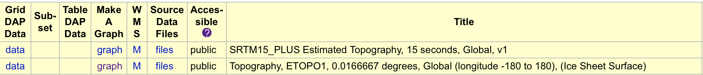

``` r
library(sporeg)
```

# Objective

This vignette is a step by step guide to the methods in "Full Disclosure:...". It will show you how to simulate semi-random tracks, derive acoustic telemetry data from those tracks, model/reconstruct tracks from those derived detection data, re-route them off land, summarize distribution information, and compare the simulated and modeled summarizations. These comparisons represent the statistical bias incurred by the modeling reconstruction and are directly related to the orientation of receivers within the study area.

Let's begin by clearing our environment.


``` r
rm(list=ls())
```

And clearing any cache we may have remaining from previous work.


``` r
gc()
#>            used  (Mb) gc trigger   (Mb)  max used   (Mb)
#> Ncells  6158613 329.0   15965602  852.7  19957002 1065.9
#> Vcells 15238421 116.3  171543472 1308.8 214429340 1636.0
```

Next, let's load the packages that we will need to run the steps in this vignette.


``` r
library(sporeg)
library(dplyr)
library(sf)
library(sp)
library(pathroutr) 

# To install pathroutr, use the following code: 
# install.packages("remotes") # If necessary, install remotes package first using: 
# remotes::install_github("jmlondon/pathroutr") 

library(parallel)
library(geosphere)
library(mapview)
library(car)
```

## Get the objects required for simulating tracks

Get the study site and set the projected coordinate system.


``` r
load(system.file("extdata", "study_site.Rda", 
                            package = "sporeg"))
```

Get the release site.


``` r
load(system.file("extdata", "rel_site.Rda", 
                            package = "sporeg"))
```

## Create the objects required for summarizing distribution information

Make the different resolution grid cells and put them all in a list.


``` r
HS_10km_grid <- grid_res(10, study_site, 3857, what = "polygons")
#> Warning: attribute variables are assumed to be spatially constant throughout all geometries
HS_25km_grid <- grid_res(25, study_site, 3857, what = "polygons")
#> Warning: attribute variables are assumed to be spatially constant throughout all geometries
HS_50km_grid <- grid_res(50, study_site, 3857, what = "polygons")
#> Warning: attribute variables are assumed to be spatially constant throughout all geometries
HS_100km_grid <- grid_res(100, study_site, 3857, what = "polygons")
#> Warning: attribute variables are assumed to be spatially constant throughout all geometries

HSgrid <- list(HS_100km_grid, HS_50km_grid, HS_25km_grid, HS_10km_grid)
```

## Get the objects required for deriving acoustic telemetry data

Get the stations.


``` r
load(system.file("extdata", "stations.Rda", 
                            package = "sporeg"))
```

## Get the objects required for re-routing tracks

Get the land barrier.


``` r
load(system.file("extdata", "land_barrier.Rda", 
                            package = "sporeg")) 

land_barrier <- land_barrier %>%
  sf::st_transform(3857) %>%
  sf::st_collection_extract('POLYGON') %>%
  sf::st_cast('POLYGON')
#> Warning in st_collection_extract.sf(., "POLYGON"): x is already of type POLYGON.
```

Create a visibility graph from the land barrier object.


``` r
vis_graph <- pathroutr::prt_visgraph(land_barrier)
```

## Set the parameters values

For simulating tracks:


``` r
# Number of animals
anims <- 30
# Number of years
yr <- 1       
# Turning angle - standard deviation of body flexion from blacktip kinematics study
theta <- c(0, 1.74)  
# Lower bound of mean recorded velocity for animal in m/s (ex: blacktip shark) (average - standard deviation)
vmin <- 0.98  
# Upper bound of mean recorded velocity for animal in m/s (ex: blacktip shark) (average + standard deviation)
vmax <- 1.58  
# Intersection of bounding box of release site(s) and study site
rel_site <- rel_site 

# Study site must be an sp object for the track simulations
study_site <- study_site 

# Name the epsg of the coordinate system for study_site
crs <- 3857

# Number of days animal is tracked
n_days <- 365*yr 
# Initial heading of animal
initHeading <- 0  
```

For the iterations:


``` r
total_iterations <- 2 # Total number of iterations desired
reps <- 2 # Number of replicates that will result in desired iterations given reps
runs <- 1:(total_iterations/reps) # Interval at which outputs should be written to file
```

## Create a cluster

This will allow us to run these processes in parallel. Here, we find out how many cores we have, not including logical cores, and create a cluster


``` r
numCores <- detectCores(logical = F)
numCores
#> [1] 16

cl <- makeCluster(numCores-4, outfile = "cluster_out")
```

Creating a cluster will create multiple instances of R on your computer. Now, we need to upload all of the libraries that each R instance will need to run the iterations. Notice that we have omitted the parallel library.


``` r
clusterEvalQ(cl, {
  
  library(sporeg)
  library(sf)
  library(sp)
  library(glatos) 
  # To install glatos, use remotes::install_github("ocean-tracking-network/glatos")
  library(dplyr)
  library(momentuHMM)
  library(crawl)
  library(lubridate)
  library(pathroutr)
  # To install pathroutr, use remotes::install_github("jmlondon/pathroutr")
  library(sfnetworks)
  library(tidyverse)
  library(stplanr)
  library(future)
  library(doFuture)
  
})
#> [[1]]
#>  [1] "doFuture"   "foreach"    "future"     "stplanr"    "forcats"    "stringr"    "purrr"      "readr"      "tidyr"      "tibble"     "ggplot2"    "tidyverse" 
#> [13] "sfnetworks" "pathroutr"  "lubridate"  "crawl"      "momentuHMM" "dplyr"      "glatos"     "sp"         "sf"         "sporeg"     "stats"      "graphics"  
#> [25] "grDevices"  "utils"      "datasets"   "methods"    "base"      
#> 
#> [[2]]
#>  [1] "doFuture"   "foreach"    "future"     "stplanr"    "forcats"    "stringr"    "purrr"      "readr"      "tidyr"      "tibble"     "ggplot2"    "tidyverse" 
#> [13] "sfnetworks" "pathroutr"  "lubridate"  "crawl"      "momentuHMM" "dplyr"      "glatos"     "sp"         "sf"         "sporeg"     "stats"      "graphics"  
#> [25] "grDevices"  "utils"      "datasets"   "methods"    "base"      
#> 
#> [[3]]
#>  [1] "doFuture"   "foreach"    "future"     "stplanr"    "forcats"    "stringr"    "purrr"      "readr"      "tidyr"      "tibble"     "ggplot2"    "tidyverse" 
#> [13] "sfnetworks" "pathroutr"  "lubridate"  "crawl"      "momentuHMM" "dplyr"      "glatos"     "sp"         "sf"         "sporeg"     "stats"      "graphics"  
#> [25] "grDevices"  "utils"      "datasets"   "methods"    "base"      
#> 
#> [[4]]
#>  [1] "doFuture"   "foreach"    "future"     "stplanr"    "forcats"    "stringr"    "purrr"      "readr"      "tidyr"      "tibble"     "ggplot2"    "tidyverse" 
#> [13] "sfnetworks" "pathroutr"  "lubridate"  "crawl"      "momentuHMM" "dplyr"      "glatos"     "sp"         "sf"         "sporeg"     "stats"      "graphics"  
#> [25] "grDevices"  "utils"      "datasets"   "methods"    "base"      
#> 
#> [[5]]
#>  [1] "doFuture"   "foreach"    "future"     "stplanr"    "forcats"    "stringr"    "purrr"      "readr"      "tidyr"      "tibble"     "ggplot2"    "tidyverse" 
#> [13] "sfnetworks" "pathroutr"  "lubridate"  "crawl"      "momentuHMM" "dplyr"      "glatos"     "sp"         "sf"         "sporeg"     "stats"      "graphics"  
#> [25] "grDevices"  "utils"      "datasets"   "methods"    "base"      
#> 
#> [[6]]
#>  [1] "doFuture"   "foreach"    "future"     "stplanr"    "forcats"    "stringr"    "purrr"      "readr"      "tidyr"      "tibble"     "ggplot2"    "tidyverse" 
#> [13] "sfnetworks" "pathroutr"  "lubridate"  "crawl"      "momentuHMM" "dplyr"      "glatos"     "sp"         "sf"         "sporeg"     "stats"      "graphics"  
#> [25] "grDevices"  "utils"      "datasets"   "methods"    "base"      
#> 
#> [[7]]
#>  [1] "doFuture"   "foreach"    "future"     "stplanr"    "forcats"    "stringr"    "purrr"      "readr"      "tidyr"      "tibble"     "ggplot2"    "tidyverse" 
#> [13] "sfnetworks" "pathroutr"  "lubridate"  "crawl"      "momentuHMM" "dplyr"      "glatos"     "sp"         "sf"         "sporeg"     "stats"      "graphics"  
#> [25] "grDevices"  "utils"      "datasets"   "methods"    "base"      
#> 
#> [[8]]
#>  [1] "doFuture"   "foreach"    "future"     "stplanr"    "forcats"    "stringr"    "purrr"      "readr"      "tidyr"      "tibble"     "ggplot2"    "tidyverse" 
#> [13] "sfnetworks" "pathroutr"  "lubridate"  "crawl"      "momentuHMM" "dplyr"      "glatos"     "sp"         "sf"         "sporeg"     "stats"      "graphics"  
#> [25] "grDevices"  "utils"      "datasets"   "methods"    "base"      
#> 
#> [[9]]
#>  [1] "doFuture"   "foreach"    "future"     "stplanr"    "forcats"    "stringr"    "purrr"      "readr"      "tidyr"      "tibble"     "ggplot2"    "tidyverse" 
#> [13] "sfnetworks" "pathroutr"  "lubridate"  "crawl"      "momentuHMM" "dplyr"      "glatos"     "sp"         "sf"         "sporeg"     "stats"      "graphics"  
#> [25] "grDevices"  "utils"      "datasets"   "methods"    "base"      
#> 
#> [[10]]
#>  [1] "doFuture"   "foreach"    "future"     "stplanr"    "forcats"    "stringr"    "purrr"      "readr"      "tidyr"      "tibble"     "ggplot2"    "tidyverse" 
#> [13] "sfnetworks" "pathroutr"  "lubridate"  "crawl"      "momentuHMM" "dplyr"      "glatos"     "sp"         "sf"         "sporeg"     "stats"      "graphics"  
#> [25] "grDevices"  "utils"      "datasets"   "methods"    "base"      
#> 
#> [[11]]
#>  [1] "doFuture"   "foreach"    "future"     "stplanr"    "forcats"    "stringr"    "purrr"      "readr"      "tidyr"      "tibble"     "ggplot2"    "tidyverse" 
#> [13] "sfnetworks" "pathroutr"  "lubridate"  "crawl"      "momentuHMM" "dplyr"      "glatos"     "sp"         "sf"         "sporeg"     "stats"      "graphics"  
#> [25] "grDevices"  "utils"      "datasets"   "methods"    "base"      
#> 
#> [[12]]
#>  [1] "doFuture"   "foreach"    "future"     "stplanr"    "forcats"    "stringr"    "purrr"      "readr"      "tidyr"      "tibble"     "ggplot2"    "tidyverse" 
#> [13] "sfnetworks" "pathroutr"  "lubridate"  "crawl"      "momentuHMM" "dplyr"      "glatos"     "sp"         "sf"         "sporeg"     "stats"      "graphics"  
#> [25] "grDevices"  "utils"      "datasets"   "methods"    "base"
```

Let's create an output file where our results will go. We only want to create this file once, otherwise we will overwrite our previous results. Thus, you will need to un-comment the lines to create it the first time. We want to assign the file name every time we run iterations, however.


``` r

# Create empty list object and save it
# results <- list()

# Assign the filename
filename <- "results.Rda"

# Save the empty list object to the filename
# save(results, file = filename)
```

Let's remove any unnecessary objects we may have created before we load the environment up to the cluster


``` r
rm(list = c("HS_100km_grid", "HS_50km_grid", "HS_25km_grid", "HS_10km_grid"))
```

Now we're ready to mirror our global environment to the cluster cores.


``` r
parallel::clusterExport(cl, varlist = ls(envir = .GlobalEnv))
```

## Run the iterations

We should now have everything in place to iterate our methods. Here, we are using `base::replicate` to decide how often to save the iterations we have made. We are using `parallel::parLapply` to create the iterations. So, if we decided to use `reps <- 10` and `runs <- 100`, we would create 1,000 total iterations and save them every 100 iterations.


``` r
base::replicate(n = reps, expr = {
    
    # Clear cache
    gc()
    
    iterated_results <- parallel::parLapply(cl, runs, fun = function(I) {
      
      # Simulate tracks 
      df <- simul_trks(anims, study_site, theta, vmin, vmax, rel_site, crs, n_days, initHeading)
      
      # Compare summary distribution info of simulated and modeled tracks across multiple grid cell resolutions
      df <- comp_trks(df, stations, land_barrier, vis_graph, HSgrid, multi.grid = TRUE, snap_tolerance = 650)
      
      return(df)
    }
    )
    # Load the previous results
    load(system.file("extdata", filename, package = "sporeg")) 
    
    # Append the new results to the previous results
    results <- append(results, iterated_results)
    
    # Overwrite the results with both the new and previous results combined
    save(results, file = system.file("extdata", filename, package = "sporeg"))
    
    # Clear cache
    gc()
    
    return(df)
  }
  )
#> [[1]]
#> function (x, df1, df2, ncp, log = FALSE) 
#> {
#>     if (missing(ncp)) 
#>         .Call(C_df, x, df1, df2, log)
#>     else .Call(C_dnf, x, df1, df2, ncp, log)
#> }
#> <bytecode: 0x000001b364717fd0>
#> <environment: namespace:stats>
#> 
#> [[2]]
#> function (x, df1, df2, ncp, log = FALSE) 
#> {
#>     if (missing(ncp)) 
#>         .Call(C_df, x, df1, df2, log)
#>     else .Call(C_dnf, x, df1, df2, ncp, log)
#> }
#> <bytecode: 0x000001b364717fd0>
#> <environment: namespace:stats>
```

## Stop the cluster

You always want to stop the cluster when you are finished using it.


``` r
parallel::stopCluster(cl)
```

## Check the results

The number of iterations we want depends on how variable our results are so let's do a power analysis after we've run a few hundred iterations.

First, let's load the results.


``` r
load(system.file("extdata", filename, package = "sporeg")) 
```

Hmm... these are hard to look at. Let's turn them into a data frame instead.


``` r
# Bind the lists by grid cell resolution
results <- lapply(results, data.table::rbindlist, idcol = 'resolution')

# Bind the bound resolution by iteration
results <- data.table::rbindlist(results, idcol = 'iteration')
```

## Remove zero inflation

Remove any cases where both `sim_count` and `mod_count` were zero for all iterations within a grid resolution. First, let's merge grid resolution size names to the main data frame.


``` r
results <- results %>%
  dplyr::left_join(dplyr::tibble(resolution = 1:4, 
                   res_name = c("100km", "50km", "25km", "10km")), 
            by = "resolution") 
```

Test for zero variance.


``` r
# Remove grid cells with zero variance
df_var <- zero_var(results) 

# Find the grid cell with zero variance
df_zero_var <- anti_join(results, df_var, by = c("res_name", "gid")) %>%
  distinct(res_name, gid)
```

### Prep for power analysis

Prep the results for a power analysis by setting some parameters for our power analysis. We previously set our number of animals, but it's likely that we've stepped away to work on other things before all these iterations finished so we can run it again here by un-commenting `anims <- 30` if we need to. Whatever variable you are interested in here, you set as `NULL`. So, if I want to know how many iterations I will need to achieve a power of 80% and an effect size within 1% of the total number of animals at a 95% significance level, I will leave `n <- NULL`.


``` r
# The number of animals
anims <- anims

# The power that we want to achieve
power <- 0.8

# The effect size we want to achieve
delta <- anims*0.01 # a delta within 1% of the total number of animals

# The level of significance that we want to achieve
sig.level <- 0.95

# The number of iterations we will need to run to achieve the other parameters that we set
n <- NULL
```

The parameters `power,` `delta,` `sig.level`, and `n` will need to be chosen based on the study itself. In the past, this [statistics book](https://www.macmillanlearning.com/college/us/product/The-Analysis-of-Biological-Data/p/131922623X?searchText=whitlock) has served as a useful resource to me. It also comes with [R code resources](https://whitlockschluter3e.zoology.ubc.ca).

[{width="225"}](https://www.macmillanlearning.com/college/us/product/The-Analysis-of-Biological-Data/p/131922623X?searchText=whitlock)

Let's calculate standard deviation by grid resolution. Now we're ready to run our power analysis. We need to run one for each grid cell resolution. So, we'll do that by setting another variable called `res` and filtering for the grid cell resolution of interest in the results that we prepped for this power analysis.


``` r
pow_stat <- df_var %>% 
  group_by(res_name, gid) %>%
  summarise(sd = sd(dif)) %>%
  ungroup() %>%
  group_by(res_name)
#> `summarise()` has grouped output by 'res_name'. You can override using the `.groups` argument.

res <- pow_stat %>% dplyr::filter(res_name == "100km")
pwr_100km <- powr(res, sig.level, power, delta)
print("Grid cell resolution: 100 km x 100 km")
#> [1] "Grid cell resolution: 100 km x 100 km"
pwr_100km
#> 
#>      Paired t test power calculation 
#> 
#>               n = 118.5833
#>           delta = 0.3
#>              sd = 3.612462
#>       sig.level = 0.95
#>           power = 0.8
#>     alternative = two.sided
#> 
#> NOTE: n is number of *pairs*, sd is std.dev. of *differences* within pairs

res <- pow_stat %>% dplyr::filter(res_name == "50km")
pwr_50km <- powr(res, sig.level, power, delta)
print("Grid cell resolution: 50 km x 50 km")
#> [1] "Grid cell resolution: 50 km x 50 km"
pwr_50km
#> 
#>      Paired t test power calculation 
#> 
#>               n = 128.0676
#>           delta = 0.3
#>              sd = 3.754149
#>       sig.level = 0.95
#>           power = 0.8
#>     alternative = two.sided
#> 
#> NOTE: n is number of *pairs*, sd is std.dev. of *differences* within pairs

res <- pow_stat %>% dplyr::filter(res_name == "25km")
pwr_25km <- powr(res, sig.level, power, delta)
print("Grid cell resolution: 25 km x 25 km")
#> [1] "Grid cell resolution: 25 km x 25 km"
pwr_25km
#> 
#>      Paired t test power calculation 
#> 
#>               n = 128.0676
#>           delta = 0.3
#>              sd = 3.754149
#>       sig.level = 0.95
#>           power = 0.8
#>     alternative = two.sided
#> 
#> NOTE: n is number of *pairs*, sd is std.dev. of *differences* within pairs


res <- pow_stat %>% dplyr::filter(res_name == "10km")
pwr_10km <- powr(res, sig.level, power, delta)
print("Grid cell resolution: 10 km x 10 km")
#> [1] "Grid cell resolution: 10 km x 10 km"
pwr_10km
#> 
#>      Paired t test power calculation 
#> 
#>               n = 143.9643
#>           delta = 0.3
#>              sd = 3.980335
#>       sig.level = 0.95
#>           power = 0.8
#>     alternative = two.sided
#> 
#> NOTE: n is number of *pairs*, sd is std.dev. of *differences* within pairs
```

## Sanity check

Do we really need THAT few/many iterations?! Let's do a sanity check here and see how variable our worst grid cell results were. We can also compare these `max_sd` results to the `sd =` printout results from the above power analyses.


``` r
max_sd <- pow_stat %>%
  ungroup() %>%
  group_by(res_name) %>%
  summarise(max_sd = max(sd))
max_sd
#> # A tibble: 4 × 2
#>   res_name max_sd
#>   <chr>     <dbl>
#> 1 100km      3.61
#> 2 10km       3.98
#> 3 25km       3.75
#> 4 50km       3.75
```

## Decisions, decisions

Here, we need to decide whether we are satisfied with the number of iterations we've run so far or if we need to run more iterations to achieve our desired power. If you want to run more iterations, you will return to the "[Create a cluster]" section. If you're satisfied, let's move on to the next section, [Satisfaction].

## Satisfaction

If you're satisfied with the results of the power analysis for your simulated acoustic detection data, let's summarize the differences between simulated and modeled tracks by grid cell within each grid resolution.

If we ran too many iterations, we can filter for the number required for each iteration, as indicated by our previous power analysis.


``` r
new_df <- df_var %>%
  dplyr::filter(res_name == "100km" & iteration <= 119 |
                  res_name == "50km" & iteration <= 128 |
                  res_name == "25km" & iteration <= 128 |
                  res_name == "10km" & iteration <= 144)

results <- new_df %>%
  group_by(res_name, gid) %>%
  summarise(avg_dif = mean(dif),
            se = plotrix::std.error(dif)) 
#> `summarise()` has grouped output by 'res_name'. You can override using the `.groups` argument.
results
#> # A tibble: 6,709 × 4
#> # Groups:   res_name [4]
#>    res_name   gid avg_dif    se
#>    <chr>    <dbl>   <dbl> <dbl>
#>  1 100km        1  11.7   0.237
#>  2 100km        2  11.7   0.237
#>  3 100km        3  27.6   0.162
#>  4 100km        4   7.36  0.202
#>  5 100km        5  26.1   0.166
#>  6 100km        6   1.71  0.112
#>  7 100km        7  21.5   0.219
#>  8 100km        8   1.48  0.123
#>  9 100km        9  22.6   0.193
#> 10 100km       10   0.933 0.183
#> # ℹ 6,699 more rows
```

# Check the methods performance

Let's create a table that shows how closely the modeled tracks compared to the reconstructed tracks for each grid resolution. Here, we compare counts of grid cells within a certain difference from `sim_count` divided by the total number of grid cells.


``` r
# Counts
how_well_ct <- results %>%
  mutate(res_name = ordered(res_name, levels = c("100km", "50km", "25km", "10km")),
         wn_0 = ifelse(avg_dif >= -1*0.3 & avg_dif <= 0.3, 1, 0),
         wn_1 = ifelse(avg_dif >= -1*1 & avg_dif <= 1, 1, 0), 
         wn_2 = ifelse(avg_dif >= -1*2 & avg_dif <= 2, 1, 0), 
         wn_3 = ifelse(avg_dif >= -1*3 & avg_dif <= 3, 1, 0), 
         wn_4 = ifelse(avg_dif >= -1*4 & avg_dif <= 4, 1, 0), 
         wn_5 = ifelse(avg_dif >= -1*5 & avg_dif <= 5, 1, 0)) %>%
    group_by(res_name) %>%
  summarise(maxgid = n(),
            tot_wn_0 = sum(wn_0),
            tot_wn_1 = sum(wn_1),
            tot_wn_2 = sum(wn_2),
            tot_wn_3 = sum(wn_3),
            tot_wn_4 = sum(wn_4),
            tot_wn_5 = sum(wn_5)) %>%
  distinct()

# Percentages
how_well <- results %>%
  mutate(res_name = ordered(res_name, levels = c("100km", "50km", "25km", "10km")),
         wn_0 = ifelse(avg_dif >= -1*0.3 & avg_dif <= 0.3, 1, 0),
         wn_1 = ifelse(avg_dif >= -1*1 & avg_dif <= 1, 1, 0), 
         wn_2 = ifelse(avg_dif >= -1*2 & avg_dif <= 2, 1, 0), 
         wn_3 = ifelse(avg_dif >= -1*3 & avg_dif <= 3, 1, 0), 
         wn_4 = ifelse(avg_dif >= -1*4 & avg_dif <= 4, 1, 0), 
         wn_5 = ifelse(avg_dif >= -1*5 & avg_dif <= 5, 1, 0)) %>%
    group_by(res_name) %>%
  summarise(maxgid = n(),
            tot_wn_0 = sum(wn_0)/maxgid*100,
            tot_wn_1 = sum(wn_1)/maxgid*100,
            tot_wn_2 = sum(wn_2)/maxgid*100,
            tot_wn_3 = sum(wn_3)/maxgid*100,
            tot_wn_4 = sum(wn_4)/maxgid*100,
            tot_wn_5 = sum(wn_5)/maxgid*100) %>%
  distinct()
```

## Track Reconstruction Issue

We had a problem in the track reconstruction where some iterations did not reconstruct tracks for all `anims`. Let's find out how many track reconstructions were successful across all the iterations for each grid cell resolution.


``` r
recon <- df_var %>%
  group_by(res_name, iteration) %>%
  summarise(max_recon = max(mod_count)) %>%
  ungroup() %>%
  group_by(res_name) %>%
  summarise(max_30 = length(which(max_recon >= 30))/max(iteration)*100,
            max_29 = length(which(max_recon >= 29))/max(iteration)*100,
            max_28 = length(which(max_recon >= 28))/max(iteration)*100,
            max_27 = length(which(max_recon >= 27))/max(iteration)*100,
            max_26 = length(which(max_recon >= 26))/max(iteration)*100,
            max_25 = length(which(max_recon >= 25))/max(iteration)*100)
#> `summarise()` has grouped output by 'res_name'. You can override using the `.groups` argument.
```

## Additional Bias

Because some tracks were not re-constructed by the movement model, we may have introduced unnecessary bias. Let's see how the model performance changes if we isolate iterations where all `anims` tracks were reconstructed. First, let's see how many iterations actually reconstructed all `anims` tracks.


``` r
recon_res <- df_var %>%
  group_by(res_name, iteration) %>%
  summarise(max_mod = max(mod_count)) %>%
  dplyr::filter(max_mod == anims) %>%
  ungroup() %>%
  group_by(res_name) %>%
  count()
#> `summarise()` has grouped output by 'res_name'. You can override using the `.groups` argument.
```

Let's re-number these iterations where all `anims` were re-constructed.


``` r
new_iters <- df_var %>%
  group_by(res_name, iteration) %>%
  summarise(max_mod = max(mod_count)) %>%
  dplyr::filter(max_mod == 30) %>%
  ungroup() %>%
  distinct(iteration) %>%
  mutate(new_iter = seq_along(iteration))
#> `summarise()` has grouped output by 'res_name'. You can override using the `.groups` argument.
```

Now we can see how our results would change if we had selected only iterations in which all `anims` were re-constructed.


``` r
new_iters_df <- merge(new_iters, df_var) %>%
  dplyr::filter(res_name == "100km" & new_iter <= 119 |
                  res_name == "50km" & new_iter <= 128 |
                  res_name == "25km" & new_iter <= 128 |
                  res_name == "10km" & new_iter <= 144)

new_results <- new_iters_df %>%
  group_by(res_name, gid) %>%
  summarise(avg_dif = mean(dif),
            se = plotrix::std.error(dif)) 
#> `summarise()` has grouped output by 'res_name'. You can override using the `.groups` argument.
new_results
#> # A tibble: 6,709 × 4
#> # Groups:   res_name [4]
#>    res_name   gid avg_dif     se
#>    <chr>    <dbl>   <dbl>  <dbl>
#>  1 100km        1 11.3    0.217 
#>  2 100km        2 11.4    0.219 
#>  3 100km        3 27.7    0.136 
#>  4 100km        4  6.13   0.190 
#>  5 100km        5 26.3    0.155 
#>  6 100km        6  0.429  0.0554
#>  7 100km        7 21.4    0.247 
#>  8 100km        8  0.0756 0.0747
#>  9 100km        9 22.5    0.217 
#> 10 100km       10 -0.454  0.168 
#> # ℹ 6,699 more rows

new_how_well <- new_results %>%
  group_by(res_name) %>%
  mutate(maxgid = max(gid),
         res_name = ordered(res_name, levels = c("100km", "50km", "25km", "10km")),
         wn_0 = ifelse(avg_dif >= -1*0.1 & avg_dif <= 0.1, 1, 0),
         wn_1 = ifelse(avg_dif >= -1*1 & avg_dif <= 1, 1, 0), 
         wn_2 = ifelse(avg_dif >= -1*2 & avg_dif <= 2, 1, 0), 
         wn_3 = ifelse(avg_dif >= -1*3 & avg_dif <= 3, 1, 0), 
         wn_4 = ifelse(avg_dif >= -1*4 & avg_dif <= 4, 1, 0), 
         wn_5 = ifelse(avg_dif >= -1*5 & avg_dif <= 5, 1, 0)) %>%
  summarise(tot_wn_0 = sum(wn_0)/maxgid*100,
            tot_wn_1 = sum(wn_1)/maxgid*100,
            tot_wn_2 = sum(wn_2)/maxgid*100,
            tot_wn_3 = sum(wn_3)/maxgid*100,
            tot_wn_4 = sum(wn_4)/maxgid*100,
            tot_wn_5 = sum(wn_5)/maxgid*100) %>%
  distinct()
#> `summarise()` has grouped output by 'res_name'. You can override using the `.groups` argument.

new_how_well
#> # A tibble: 4 × 7
#> # Groups:   res_name [4]
#>   res_name tot_wn_0 tot_wn_1 tot_wn_2 tot_wn_3 tot_wn_4 tot_wn_5
#>   <ord>       <dbl>    <dbl>    <dbl>    <dbl>    <dbl>    <dbl>
#> 1 100km      11.8      31.2      37.6     39.8     40.9     44.1
#> 2 50km        3.42     14.0      22.6     28.8     32.2     39.4
#> 3 25km        0.710     7.40     15.7     21.7     26.1     30.7
#> 4 10km        1.05      7.14     14.2     19.8     25.2     29.7
```

## Gather more information

In this section, we want to find out why the results are the way they are. Can we derive some information about the grid cells that tell us what contributes to a better result?

First, let's gather information on the depth in each grid cell. For this example, I have logged onto the National Oceanic and Atmospheric Administration (NOAA) [ERDDAP server](https://coastwatch.pfeg.noaa.gov/erddap/search/advanced.html?page=1&itemsPerPage=1000) and gathered depth information for the bounding box of the study site, which must be in a geographic coordinate system (e.g., NAD 1983). Let's get the bounding box of our study site.[^1]

[^1]: Note: Some acoustic telemetry users along the U.S. Eastern Seaboard have experienced theft of their equipment and so they are hesitant to share exact locations of receivers. For that reason, the real receiver locations in this vignette have been obscured with a false origin and the related shapefiles were altered in kind to visually match the obscured receiver locations. However, to get the actual environmental information required to make meaningful inferences about these results, we need to pull information from the actual study site. Therefore, we call in the actual study site for this section.


``` r
# Objects required for iterations to run
load(system.file("extdata", "site_depth.Rda", package = "sporeg")) 

site_depth <- site_depth %>%
  sf::st_as_sf() %>%
  sf::st_transform(4269)

sf::st_bbox(site_depth)
#>      xmin      ymin      xmax      ymax 
#> -81.65038  24.32100 -69.28000  41.85253
```

We will use the `xmin` (Min Longitude), `ymin` (Min Latitude), `xmax` (Max Longitude), and `ymax` (Max Latitude) to search for relevant depth (altitude) data in the ERDDAP server.


We are going to use the `DatasetID: etopo180`



{width="229"}

Click on `graph` and then click on `Download the Data or an Image`


Save the export.


``` r
load(system.file("extdata", "atlcoast.Rda", package = "sporeg")) 

atlcoast <- atlcoast %>%
  sf::st_transform(4269)
```

Read in depth data. For now, we will load the demonstration depth_data file. Here, we also filter the depth data to only be those depths found inside the study site - right now, it's everything inside the grid bounding box.


``` r
load(system.file("extdata", "depth_data.Rda", package = "sporeg"))

depth_data <- depth_data %>%
  sf::st_as_sf(coords = c("longitude", "latitude"), crs = 4269)

depth_data <- sf::st_filter(depth_data, site_depth) %>% 
  mutate(uid = seq_along(geometry)) 
```

We also need to re-create the grids without the false origin.[^2] The study site must be in a projected coordinate system (WGS 84; EPSG: 3857) when it is initially fed into the function `grid_res`.

[^2]: Note: Some acoustic telemetry users along the U.S. Eastern Seaboard have experienced theft of their equipment and so they are hesitant to share exact locations of receivers. For that reason, the real receiver locations in this vignette have been obscured with a false origin and the related shapefiles were altered in kind to visually match the obscured receiver locations. However, to get the actual environmental information required to make meaningful inferences about these results, we need to pull information from the actual study site. Therefore, we call in the actual study site for this section.


``` r
site_depth <- site_depth %>%
  sf::st_transform(., 3857)

HS_100km_grid <- grid_res(100, site_depth, 4269, "polygons")
HS_50km_grid <- grid_res(50, site_depth, 4269, "polygons")
HS_25km_grid <- grid_res(25, site_depth, 4269, "polygons")
HS_10km_grid <- grid_res(10, site_depth, 4269, "polygons")
```

Merge depth data with different grid cell resolutions.


``` r
HS_100km_grid <- depth_data(HS_100km_grid, depth_data)
HS_50km_grid <- depth_data(HS_50km_grid, depth_data)
HS_25km_grid <- depth_data(HS_25km_grid, depth_data)
HS_10km_grid <- depth_data(HS_10km_grid, depth_data)

rm(depth)
gc()
#>            used  (Mb) gc trigger   (Mb)  max used   (Mb)
#> Ncells  7241735 386.8   15965602  852.7  19957002 1065.9
#> Vcells 88571060 675.8  228085467 1740.2 228085359 1740.2
```

Calculate distance to shore, density of receivers, presence/absence of receivers, and merge with grid cell depth data. We can do all of this using the false origin shapefiles.


``` r
load(system.file("extdata", "fo_sts_pts.Rda", package = "sporeg")) 

fo_sts_pts <- fo_sts_pts %>%
  sf::st_centroid()

load(system.file("extdata", "fo_study_site.Rda", package = "sporeg")) 
  
load(system.file("extdata", "fo_land_barrier.Rda", package = "sporeg")) 

fo_land_barrier <- fo_land_barrier %>%
  sf::st_transform(3857) %>%
  sf::st_collection_extract('POLYGON') %>%
  sf::st_cast('POLYGON') %>%
  sf::st_union() %>%
  sf::st_as_sf()

epsg = 3857

HS_100km_grid <- merge((HS_100km_grid %>% as.data.frame() %>% dplyr::select(-geometry)), d_shore_rcvs(100, study_site, fo_land_barrier, epsg, fo_sts_pts), by = "gid") %>%
  sf::st_as_sf() 

HS_50km_grid <- merge((HS_50km_grid %>% as.data.frame %>% dplyr::select(-geometry)), d_shore_rcvs(50, study_site, fo_land_barrier, epsg, fo_sts_pts), by = "gid") %>%
  sf::st_as_sf()

HS_25km_grid <- merge((HS_25km_grid %>% as.data.frame %>% dplyr::select(-geometry)), d_shore_rcvs(25, study_site, fo_land_barrier, epsg, fo_sts_pts), by = "gid") %>%
  sf::st_as_sf()

HS_10km_grid <- merge((HS_10km_grid %>% as.data.frame %>% dplyr::select(-geometry)), d_shore_rcvs(10, study_site, fo_land_barrier, epsg, fo_sts_pts), by = "gid") %>%
  sf::st_as_sf()
```

Let's find out how many grid cells lacked receivers.


``` r
grids <- list(HS_100km_grid, HS_50km_grid, HS_25km_grid, HS_10km_grid)

grids <- sf::st_as_sf(data.table::rbindlist(grids, idcol = 'resolution')) %>%
  left_join(tibble(resolution = 1:4, res_name = c("100km", "50km", "25km", "10km")), by = "resolution") %>%
  mutate(res_name = ordered(res_name, levels = c("100km", "50km", "25km", "10km")))

no_rcv <- grids %>%
  group_by(res_name) %>%
  summarise(n_zeroes = sum(p_a == "0"),
            perc_zeroes = n_zeroes/max(gid)*100) %>%
  as.data.frame %>%
  dplyr::select(-x)
```

Merge the results to these grid cell metadata and determine which grid cells exhibited a good fit.


``` r
results <- results %>%
  mutate(g_fit = ifelse(avg_dif>= -1*0.1*anims & avg_dif <= 0.1*anims, 1, 0))

HS_100km_grid <- merge(results %>% dplyr::filter(res_name == "100km"), HS_100km_grid, by = c("gid")) %>% 
  sf::st_as_sf() 

HS_50km_grid <- merge(results %>% dplyr::filter(res_name == "50km"), HS_50km_grid, by = c("gid")) %>%
  sf::st_as_sf() 

HS_25km_grid <- merge(results %>% dplyr::filter(res_name == "25km"), HS_25km_grid, by = c("gid")) %>%
  sf::st_as_sf() 

HS_10km_grid <- merge(results %>% dplyr::filter(res_name == "10km"), HS_10km_grid, by = c("gid")) %>%
  sf::st_as_sf() 
```

## Map results

Let's map these and see what kind of spatial trends we can see.


``` r
mapview::mapView(HS_100km_grid)
#> Error in loadNamespace(name): there is no package called 'webshot'
mapview::mapView(HS_50km_grid)
#> Error in loadNamespace(name): there is no package called 'webshot'
mapview::mapView(HS_25km_grid)
#> Error in loadNamespace(name): there is no package called 'webshot'
mapview::mapView(HS_10km_grid)
#> Error in loadNamespace(name): there is no package called 'webshot'
```

## Map the results

Let's marry our results to a sf object that lacks a false origin so that we can more easily map them.


``` r
# Create grids without false origin
study_site <- study_site %>% # UTM 17N
  sf::st_transform(4269) %>% # Convert to NAD 1983
  sf::st_transform(3857) # Convert to WGS 84

HS100km <- grid_res(100, study_site, 3857, "polygons")
HS50km <- grid_res(50, study_site, 3857, "polygons")
HS25km <- grid_res(25, study_site, 3857, "polygons")
HS10km <- grid_res(10, study_site, 3857, "polygons")

# Merge results data to new geometries
HS100km <- merge((HS_100km_grid %>% as.data.frame() %>% dplyr::select(-x)), HS100km, by = c("gid")) %>% 
  sf::st_as_sf() 

HS50km <- merge((HS_50km_grid %>% as.data.frame() %>% dplyr::select(-x)), HS50km, by = c("gid")) %>%
  sf::st_as_sf()

HS25km <- merge((HS_25km_grid %>% as.data.frame() %>% dplyr::select(-x)), HS25km, by = c("gid")) %>%
  sf::st_as_sf()

HS10km <- merge((HS_10km_grid %>% as.data.frame() %>% dplyr::select(-x)), HS10km, by = c("gid")) %>%
  sf::st_as_sf()
```

# Model the effects

We want to create a model to understand which variables affect a good fit in the grid cells.

## Create a dummy model

We need to check for multicollinearity between main effects to see if we need to include any interaction terms between main effects in the model.


``` r
dummy.fit <- glm(formula = g_fit ~ den_rcs + p_a + mean_depth + d_shore, family = binomial(), data = HS_10km_grid)

car::vif(dummy.fit)
#>    den_rcs        p_a mean_depth    d_shore 
#>   1.715691   1.710425   3.200149   3.207655
```


``` r
# 100 x 100km resolution
fit1.100km <- glm(formula = g_fit ~ den_rcs + p_a + mean_depth + d_shore,
                 family = binomial(), data = HS_100km_grid)

# den_rcs      1.7679  1  0.1836395

fit2.100km <- glm(formula = g_fit ~ p_a + mean_depth + d_shore,
                 family = binomial(), data = HS_100km_grid)

car::Anova(fit2.100km)
#> Analysis of Deviance Table (Type II tests)
#> 
#> Response: g_fit
#>            LR Chisq Df Pr(>Chisq)    
#> p_a          38.654  1   5.06e-10 ***
#> mean_depth   13.370  1  0.0002557 ***
#> d_shore       4.798  1  0.0284877 *  
#> ---
#> Signif. codes:  0 '***' 0.001 '**' 0.01 '*' 0.05 '.' 0.1 ' ' 1


# 50 x 50km resolution
fit1.50km <- glm(formula = g_fit ~ den_rcs + p_a + mean_depth + d_shore,
                 family = binomial(), data = HS_50km_grid)

# d_shore      0.1248  1     0.7239

fit2.50km <- glm(formula = g_fit ~ den_rcs + p_a + mean_depth,
                 family = binomial(), data = HS_50km_grid)

# den_rcs       0.305  1     0.5809 

fit3.50km <- glm(formula = g_fit ~ p_a + mean_depth,
                 family = binomial(), data = HS_50km_grid)

car::Anova(fit3.50km)
#> Analysis of Deviance Table (Type II tests)
#> 
#> Response: g_fit
#>            LR Chisq Df Pr(>Chisq)    
#> p_a          23.977  1  9.748e-07 ***
#> mean_depth   47.514  1  5.462e-12 ***
#> ---
#> Signif. codes:  0 '***' 0.001 '**' 0.01 '*' 0.05 '.' 0.1 ' ' 1

# 25 x 25km resolution
fit1.25km <- glm(formula = g_fit ~ den_rcs + p_a + mean_depth + d_shore,
                 family = binomial(), data = HS_25km_grid)

# d_shore       2.161  1    0.14154

fit2.25km <- glm(formula = g_fit ~ den_rcs + p_a + mean_depth,
                 family = binomial(), data = HS_25km_grid)

car::Anova(fit2.25km)
#> Analysis of Deviance Table (Type II tests)
#> 
#> Response: g_fit
#>            LR Chisq Df Pr(>Chisq)    
#> den_rcs       5.395  1    0.02019 *  
#> p_a          33.317  1  7.828e-09 ***
#> mean_depth  151.463  1  < 2.2e-16 ***
#> ---
#> Signif. codes:  0 '***' 0.001 '**' 0.01 '*' 0.05 '.' 0.1 ' ' 1

# 10 x 10km resolution
fit1.10km <- glm(formula = g_fit ~ den_rcs + p_a + mean_depth + d_shore,
                 family = binomial(), data = HS_10km_grid)

car::Anova(fit1.10km)
#> Analysis of Deviance Table (Type II tests)
#> 
#> Response: g_fit
#>            LR Chisq Df Pr(>Chisq)    
#> den_rcs      13.876  1  0.0001952 ***
#> p_a          28.967  1  7.361e-08 ***
#> mean_depth  204.521  1  < 2.2e-16 ***
#> d_shore       8.777  1  0.0030512 ** 
#> ---
#> Signif. codes:  0 '***' 0.001 '**' 0.01 '*' 0.05 '.' 0.1 ' ' 1
```

## Is the model useful?

Now that we've constructed the model using backward selection by p-value, let's evaluate whether or not it is useful. We'll do this by comparing the null deviance to the residual deviance. `p-value = 1 - pchisq(null deviance - residual deviance, degrees of freedom)`


``` r
summary(fit2.100km)
#> 
#> Call:
#> glm(formula = g_fit ~ p_a + mean_depth + d_shore, family = binomial(), 
#>     data = HS_100km_grid)
#> 
#> Coefficients:
#>               Estimate Std. Error z value Pr(>|z|)    
#> (Intercept) -1.799e+00  6.267e-01  -2.870  0.00410 ** 
#> p_a1         3.979e+00  8.102e-01   4.911 9.05e-07 ***
#> mean_depth  -2.158e-02  7.689e-03  -2.806  0.00501 ** 
#> d_shore      1.879e-05  8.853e-06   2.123  0.03378 *  
#> ---
#> Signif. codes:  0 '***' 0.001 '**' 0.01 '*' 0.05 '.' 0.1 ' ' 1
#> 
#> (Dispersion parameter for binomial family taken to be 1)
#> 
#>     Null deviance: 120.090  on 91  degrees of freedom
#> Residual deviance:  59.388  on 88  degrees of freedom
#>   (1 observation deleted due to missingness)
#> AIC: 67.388
#> 
#> Number of Fisher Scoring iterations: 7

p_value.100km = 1 - pchisq(120.090-59.388, 3)
p_value.100km
#> [1] 4.161116e-13

summary(fit3.50km)
#> 
#> Call:
#> glm(formula = g_fit ~ p_a + mean_depth, family = binomial(), 
#>     data = HS_50km_grid)
#> 
#> Coefficients:
#>              Estimate Std. Error z value Pr(>|z|)    
#> (Intercept) -0.584305   0.253586  -2.304 0.021213 *  
#> p_a1         1.557870   0.326283   4.775  1.8e-06 ***
#> mean_depth  -0.025806   0.006803  -3.793 0.000149 ***
#> ---
#> Signif. codes:  0 '***' 0.001 '**' 0.01 '*' 0.05 '.' 0.1 ' ' 1
#> 
#> (Dispersion parameter for binomial family taken to be 1)
#> 
#>     Null deviance: 327.03  on 285  degrees of freedom
#> Residual deviance: 233.64  on 283  degrees of freedom
#>   (6 observations deleted due to missingness)
#> AIC: 239.64
#> 
#> Number of Fisher Scoring iterations: 8

p_value.50km = 1 - pchisq(327.03-233.64, 3)
p_value.50km
#> [1] 0

summary(fit2.25km)
#> 
#> Call:
#> glm(formula = g_fit ~ den_rcs + p_a + mean_depth, family = binomial(), 
#>     data = HS_25km_grid)
#> 
#> Coefficients:
#>               Estimate Std. Error z value Pr(>|z|)    
#> (Intercept)  -0.488155   0.143319  -3.406 0.000659 ***
#> den_rcs     -10.429624   4.778274  -2.183 0.029057 *  
#> p_a1          1.346413   0.233967   5.755 8.68e-09 ***
#> mean_depth   -0.036931   0.005238  -7.051 1.78e-12 ***
#> ---
#> Signif. codes:  0 '***' 0.001 '**' 0.01 '*' 0.05 '.' 0.1 ' ' 1
#> 
#> (Dispersion parameter for binomial family taken to be 1)
#> 
#>     Null deviance: 975.40  on 967  degrees of freedom
#> Residual deviance: 750.33  on 964  degrees of freedom
#>   (18 observations deleted due to missingness)
#> AIC: 758.33
#> 
#> Number of Fisher Scoring iterations: 8

p_value.25km = 1 - pchisq(975.40-750.33, 3)
p_value.25km
#> [1] 0

summary(fit1.10km)
#> 
#> Call:
#> glm(formula = g_fit ~ den_rcs + p_a + mean_depth + d_shore, family = binomial(), 
#>     data = HS_10km_grid)
#> 
#> Coefficients:
#>               Estimate Std. Error z value Pr(>|z|)    
#> (Intercept) -2.469e-01  6.084e-02  -4.059 4.93e-05 ***
#> den_rcs     -7.281e+00  2.261e+00  -3.220  0.00128 ** 
#> p_a1         8.672e-01  1.632e-01   5.313 1.08e-07 ***
#> mean_depth  -3.072e-02  3.852e-03  -7.975 1.53e-15 ***
#> d_shore     -6.291e-06  2.095e-06  -3.003  0.00267 ** 
#> ---
#> Signif. codes:  0 '***' 0.001 '**' 0.01 '*' 0.05 '.' 0.1 ' ' 1
#> 
#> (Dispersion parameter for binomial family taken to be 1)
#> 
#>     Null deviance: 5012.5  on 5198  degrees of freedom
#> Residual deviance: 4012.9  on 5194  degrees of freedom
#>   (139 observations deleted due to missingness)
#> AIC: 4022.9
#> 
#> Number of Fisher Scoring iterations: 9

p_value.10km = 1 - pchisq(5012.5-4012.9, 3)
p_value.10km
#> [1] 0
```

## Calculate odds ratios

We want to know how much each main effect increases (or decreases) the odds of a good fit occurring so we need to calculate the odds ratios.


``` r
odds_100km <- get_or(fit2.100km) %>%
  mutate(res_name = "100km")

odds_50km <- get_or(fit3.50km) %>%
  mutate(res_name = "50km")

odds_25km <- get_or(fit2.25km) %>%
  mutate(res_name = "25km")

odds_10km <- get_or(fit1.10km) %>%
  mutate(res_name = "10km")

odds_ratios <- rbind(odds_100km, odds_50km, odds_25km, odds_10km)
```

## How many receivers?

Let's find out how the density of receivers varied for each grid cell resolution.


``` r
res <- list(HS_100km_grid, HS_50km_grid, HS_25km_grid, HS_10km_grid)

rcv_dens <- lapply(res, den_rcvs)

rcv_dens <- data.table::rbindlist(rcv_dens, idcol = 'resolution') %>%
  left_join(tibble(resolution = 1:4, 
                   res_name = c("100km", "50km", "25km", "10km")), 
            by = "resolution") %>%
  mutate(res_name = ordered(res_name, levels = c("100km", "50km", "25km", "10km")))
```

## Where do good fits occur?

What are the characteristics of the grid cells that exhibited a good fit?


``` r
gd_fit_char <- lapply(res, gd_fts) %>%
  data.table::rbindlist(., idcol = 'resolution') %>%
  left_join(tibble(resolution = 1:4, 
                   res_name = c("100km", "50km", "25km", "10km")), 
            by = "resolution") %>%
  mutate(res_name = ordered(res_name, levels = c("100km", "50km", "25km", "10km")))
```

# Do the methods close gaps?

Let's find out how many of the good fits occurred in grid cells that lacked receivers. We can use the results list `res` that we created in the previous step and apply a function over all resolutions at the same time.


``` r
clsd_gps <- lapply(res, gps_fld) %>%
  data.table::rbindlist(., idcol = 'resolution') %>%
  left_join(tibble(resolution = 1:4, 
                   res_name = c("100km", "50km", "25km", "10km")), 
            by = "resolution") %>%
  mutate(res_name = ordered(res_name, levels = c("100km", "50km", "25km", "10km")))
```

## Where are these closed gaps?

Let's find out where these closed gaps are located (e.g., are they coastal?).


``` r

clsd_gp_chars <- lapply(res, gps_chr) %>%
  data.table::rbindlist(., idcol = 'resolution') %>%
  left_join(tibble(resolution = 1:4, 
                   res_name = c("100km", "50km", "25km", "10km")), 
            by = "resolution") %>%
  mutate(res_name = ordered(res_name, levels = c("100km", "50km", "25km", "10km")))
```

## Where are receivers located?

Let's find out where most of the receivers are in the current array.


``` r

rcv_chars <- lapply(res, rcv_chr) %>%
  data.table::rbindlist(., idcol = 'resolution') %>%
  left_join(tibble(resolution = 1:4, 
                   res_name = c("100km", "50km", "25km", "10km")), 
            by = "resolution") %>%
  mutate(res_name = ordered(res_name, levels = c("100km", "50km", "25km", "10km")))
```

## What if we had chosen a different depth cutoff?

Blacktip sharks, the species chosen to demonstrate the current methods, is known to cross the Gulf Stream, which is in deep waters, on occasion. However, in a mark and recapture study, this species was not caught in a location with a depth greater than 265 m. If we cut off our study to 300 m, how do our results change?


``` r

depth_limit <- 300 # [m]

dif_depth <- lapply(res, dif_co) %>%
  data.table::rbindlist(., idcol = 'resolution') %>%
  left_join(tibble(resolution = 1:4, 
                   res_name = c("100km", "50km", "25km", "10km")), 
            by = "resolution") %>%
  mutate(res_name = ordered(res_name, levels = c("100km", "50km", "25km", "10km")))
```

# Demonstrate ecological application

Let's apply these methods to real acoustic telemetry data so we can derive distribution information.


``` r

load(system.file("extdata", "demo_dets.Rda", package = "sporeg"))

demo_dets <- demo_dets %>%
    dplyr::arrange(ID, time) %>%
    dplyr::group_by(ID, time) %>%
    dplyr::summarize(mean_pos = sf::st_combine(geometry)) %>%
    sf::st_centroid() %>%
    dplyr::mutate(time = as.POSIXct(time),
           x = sf::st_coordinates(mean_pos)[,1],
           y = sf::st_coordinates(mean_pos)[,2],
           locType = "o") %>% # Obtain x and y coordinates so that you can merge with predicted locations later
    sf::st_drop_geometry() %>%
    as.data.frame
#> `summarise()` has grouped output by 'ID'. You can override using the `.groups` argument.
```

Now we can run the movement model, a continuous-time correlated random walk model, using the momentuHMM R package, to impute locations between observations.


``` r
demo_dets <- momentuHMM::crawlWrap(obsData = demo_dets, timeStep = "15 min",
                                    fixPar = c(NA, NA),
                                    theta = c(8,0),
                                    attempts = 100, retrySD = 5, retryFits = 5,
                                    ncores = 2, retryParallel = TRUE)
#> Fitting 10 track(s) using crawl::crwMLE...
#> Individual 1...
#> Individual 2...
#> Individual 3...
#> Individual 4...
#> Individual 5...
#> Beginning SANN initialization ...
#> Beginning likelihood optimization ...
#> Beginning SANN initialization ...
#> Beginning likelihood optimization ...
#> Beginning SANN initialization ...
#> Beginning likelihood optimization ...
#> Beginning SANN initialization ...
#> Beginning likelihood optimization ...
#> Beginning SANN initialization ...
#> Beginning likelihood optimization ...
#> Individual 6...
#> Individual 7...
#> Individual 8...
#> Individual 9...
#> Individual 10...
#> Beginning SANN initialization ...
#> Beginning likelihood optimization ...
#> Beginning SANN initialization ...
#> Beginning likelihood optimization ...
#> Beginning SANN initialization ...
#> Beginning likelihood optimization ...
#> Beginning SANN initialization ...
#> Beginning likelihood optimization ...
#> Beginning SANN initialization ...
#> Beginning likelihood optimization ...
#> DONE
#> 
#> Attempting to achieve convergence and valid variance estimates for each individual in parallel.
#>     Press 'esc' to force exit from 'crawlWrap'... 
#> Attempting to improve fit for individual 1. Press 'esc' to force exit from 'crawlWrap'
#> 
    Attempt 1 of 5 -- current log-likelihood value: -1806.721  ...
    Attempt 2 of 5 -- current log-likelihood value: -1806.721  ...
    Attempt 3 of 5 -- current log-likelihood value: -1806.721  ...
    Attempt 4 of 5 -- current log-likelihood value: -1806.721  ...
    Attempt 5 of 5 -- current log-likelihood value: -1806.721  ...DONE
#> Attempting to improve fit for individual 2. Press 'esc' to force exit from 'crawlWrap'
#> 
    Attempt 1 of 5 -- current log-likelihood value: -4507.896  ...
    Attempt 2 of 5 -- current log-likelihood value: -4507.896  ...
    Attempt 3 of 5 -- current log-likelihood value: -4507.896  ...
    Attempt 4 of 5 -- current log-likelihood value: -4507.896  ...
    Attempt 5 of 5 -- current log-likelihood value: -4507.896  ...DONE
#> Attempting to improve fit for individual 3. Press 'esc' to force exit from 'crawlWrap'
#> 
    Attempt 1 of 5 -- current log-likelihood value: -4766.611  ...
    Attempt 2 of 5 -- current log-likelihood value: -4766.611  ...
    Attempt 3 of 5 -- current log-likelihood value: -4766.611  ...
    Attempt 4 of 5 -- current log-likelihood value: -4766.611  ...
    Attempt 5 of 5 -- current log-likelihood value: -4766.611  ...DONE
#> Attempting to improve fit for individual 4. Press 'esc' to force exit from 'crawlWrap'
#> 
    Attempt 1 of 5 -- current log-likelihood value: -5101.935  ...
    Attempt 2 of 5 -- current log-likelihood value: -5101.935  ...
    Attempt 3 of 5 -- current log-likelihood value: -5101.935  ...
    Attempt 4 of 5 -- current log-likelihood value: -5101.935  ...
    Attempt 5 of 5 -- current log-likelihood value: -5101.935  ...DONE
#> Attempting to improve fit for individual 5. Press 'esc' to force exit from 'crawlWrap'
#> 
    Attempt 1 of 5 -- current log-likelihood value: -2829.118  ...
    Attempt 2 of 5 -- current log-likelihood value: -2829.118  ...
    Attempt 3 of 5 -- current log-likelihood value: -2829.118  ...
    Attempt 4 of 5 -- current log-likelihood value: -2829.118  ...
    Attempt 5 of 5 -- current log-likelihood value: -2829.118  ...DONE
#> Attempting to improve fit for individual 6. Press 'esc' to force exit from 'crawlWrap'
#> 
    Attempt 1 of 5 -- current log-likelihood value: -198.0223  ...
    Attempt 2 of 5 -- current log-likelihood value: -198.0223  ...
    Attempt 3 of 5 -- current log-likelihood value: -198.0223  ...
    Attempt 4 of 5 -- current log-likelihood value: -198.0223  ...
    Attempt 5 of 5 -- current log-likelihood value: -198.0223  ...DONE
#> Attempting to improve fit for individual 7. Press 'esc' to force exit from 'crawlWrap'
#> 
    Attempt 1 of 5 -- current log-likelihood value: -1452.093  ...
    Attempt 2 of 5 -- current log-likelihood value: -1452.093  ...
    Attempt 3 of 5 -- current log-likelihood value: -1452.093  ...
    Attempt 4 of 5 -- current log-likelihood value: -1452.093  ...
    Attempt 5 of 5 -- current log-likelihood value: -1452.093  ...DONE
#> Attempting to improve fit for individual 8. Press 'esc' to force exit from 'crawlWrap'
#> 
    Attempt 1 of 5 -- current log-likelihood value: -127.5107  ...
    Attempt 2 of 5 -- current log-likelihood value: -127.5107  ...
    Attempt 3 of 5 -- current log-likelihood value: -127.5107  ...
    Attempt 4 of 5 -- current log-likelihood value: -127.5107  ...
    Attempt 5 of 5 -- current log-likelihood value: -127.5107  ...DONE
#> Attempting to improve fit for individual 9. Press 'esc' to force exit from 'crawlWrap'
#> 
    Attempt 1 of 5 -- current log-likelihood value: -3431.439  ...
    Attempt 2 of 5 -- current log-likelihood value: -3431.439  ...
    Attempt 3 of 5 -- current log-likelihood value: -3431.439  ...
    Attempt 4 of 5 -- current log-likelihood value: -3431.439  ...
    Attempt 5 of 5 -- current log-likelihood value: -3431.439  ...DONE
#> Attempting to improve fit for individual 10. Press 'esc' to force exit from 'crawlWrap'
#> 
    Attempt 1 of 5 -- current log-likelihood value: -3396.162  ...
    Attempt 2 of 5 -- current log-likelihood value: -3396.162  ...
    Attempt 3 of 5 -- current log-likelihood value: -3396.162  ...
    Attempt 4 of 5 -- current log-likelihood value: -3396.162  ...
    Attempt 5 of 5 -- current log-likelihood value: -3396.162  ...DONE
#> 
#> Predicting locations (and uncertainty) at 15 mins time steps for 10 track(s) using crawl::crwPredict... DONE

demo_dets <- data.frame(demo_dets$crwPredict)
```

Turn the movement model product into a data frame and label the predicted locations.


``` r
demo_dets <- demo_dets %>%
    dplyr::select(ID, locType, time, mu.x, mu.y, speed) %>%
    dplyr::mutate(locType = ifelse(is.na(locType), "p", locType)) %>%  #Specify predicted locs
    as.data.frame

demo_dets <- demo_dets %>%
    dplyr::select(ID, time, mu.x, mu.y) %>%
    dplyr::mutate(time = lubridate::ymd_hms(format(as.POSIXct(time, tz = "UTC"), "%Y-%m-%d %H:%M:%S", ID = as.factor(ID))))
```

Since the movement model does not recognize land, let's re-route the parts that crossed the land barrier.


``` r
CRS <- 3857

load(system.file("extdata", "atlcoast.Rda", package = "sporeg"))

barrier <- atlcoast %>% sf::st_transform(., 3857)
vis_graph <- pathroutr::prt_visgraph(barrier)
#> Warning in st_cast.sf(barrier, "POLYGON"): repeating attributes for all sub-geometries for which they may not be constant
buffer <- 650
  
tbuff650 <- sub_rrt(demo_dets, CRS, barrier, vis_graph, buffer)
#> Warning in st_collection_extract.sf(., "POLYGON"): x is already of type POLYGON.
#> Warning in st_cast.sf(., "POLYGON"): repeating attributes for all sub-geometries for which they may not be constant

# Check map
mapview::mapView(tbuff650)
#> Error in loadNamespace(name): there is no package called 'webshot'
```

## Calculate grid counts

Here, we need to calculate the number of unique individuals in each grid cell so that we can determine the distribution of the population.


``` r
sg <- grid_res(50, study_site, epsg = 3857, what = "polygons")
#> Warning: attribute variables are assumed to be spatially constant throughout all geometries

subset_cts <- cts(sg, tbuff650)
```

How would it differ if we just used the daily summarized acoustic telemetry data to derive distribution information?


``` r

load(system.file("extdata", "at_dly_locs.Rda", package = "sporeg"))

sg <- grid_res(50, study_site, epsg = 3857, what = "polygons")
#> Warning: attribute variables are assumed to be spatially constant throughout all geometries

at_dly_locs_cts <- cts(sg, at_dly_locs)
```

What if we connected those data with straight lines?


``` r

load(system.file("extdata", "at_dly_locs.Rda", package = "sporeg"))

at_lines <- at_dly_locs %>%
  group_by(ID, time) %>%
  sf::st_transform(3857) %>%
  summarise(pt = sf::st_combine(geometry)) %>%
  sf::st_centroid() %>%
  mutate(lat = sf::st_coordinates(pt)[,2],
         lon = sf::st_coordinates(pt)[,1]) %>%
  arrange(ID, time) %>%
  mutate(start_x = lon, start_y = lat, end_x = lead(lon), end_y = lead(lat)) %>% #Prep data for making lines - ensures proper order
  sf::st_as_sf(coords = c("lon", "lat"), crs = 3857) %>%
  filter(!is.na(end_y)) %>%
  tidyr::nest() %>% 
  mutate(
    data = purrr::map(data, 
                      ~ mutate(.x,
                               x = purrr::pmap(.l = list(start_x, start_y, end_x, end_y),
                                               .f = make_line)))) %>%
  mutate(
      data = purrr::map(data,
                        ~ mutate(.x, x = sf::st_sfc(x))),
      x = purrr::map(data, ~ sf::st_union(sf::st_set_geometry(.x, 'x'))), ##Preserves order
      x = purrr::map(x, ~ sf::st_cast(.x, 'MULTILINESTRING')) 
    ) %>% 
    dplyr::select(-data) %>% 
    tidyr::unnest(x) %>% 
    sf::st_as_sf(sf_column_name = 'x', crs = 3857)
#> `summarise()` has grouped output by 'ID'. You can override using the `.groups` argument.

sg <- grid_res(50, study_site, epsg = 3857, what = "polygons")
#> Warning: attribute variables are assumed to be spatially constant throughout all geometries

at_line_cts <- cts(sg, at_lines)
```

## Map good fits over ecological data

Let's merge the results that have a false origin with the distribution data so we know where we can rely on the results.


``` r

goodfts_50km <- merge((HS_50km_grid %>% as.data.frame() %>% dplyr::select(-x)), at_line_cts, by = "gid") %>%
  sf::st_as_sf()
```

## Map reconstruction results

Let's map the mean differences with the corrected map projection.


``` r

mapview::mapView(goodfts_50km, zcol = "avg_dif")
#> Error in loadNamespace(name): there is no package called 'webshot'
```
